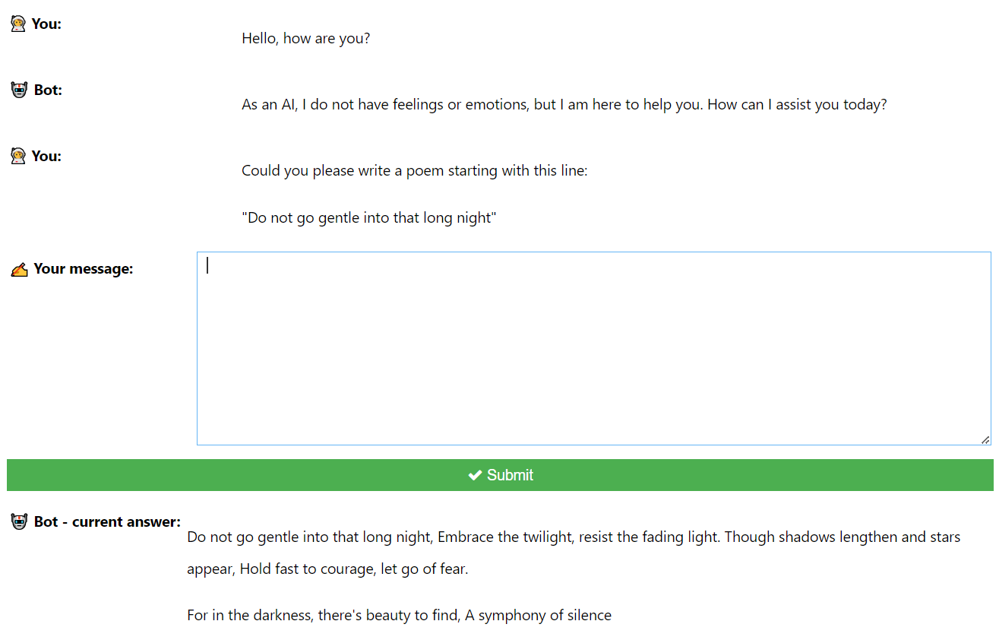

This repo proposes a chat.ipynb notebook that allows you to discuss with GPT through its API.
Using the API ends up being much cheaper than paying a monthly fee!

Here is an example: over the last week I've paid just over 2\$, for a heavier than usual usage, which would be 8\$ a month instead of the ChatGPT monthly price of 20\$.

- The dialog boxes are simple IPython widgets.
- Making use of the `stream=True` option in `openai.Chatcompletion` allows to dialog much faster with GPT.

# How to use

Well, just clone this repo, install the `requirements.txt`, copy paste your [OpenAI API Key](https://platform.openai.com/account/api-keys) and get started.

